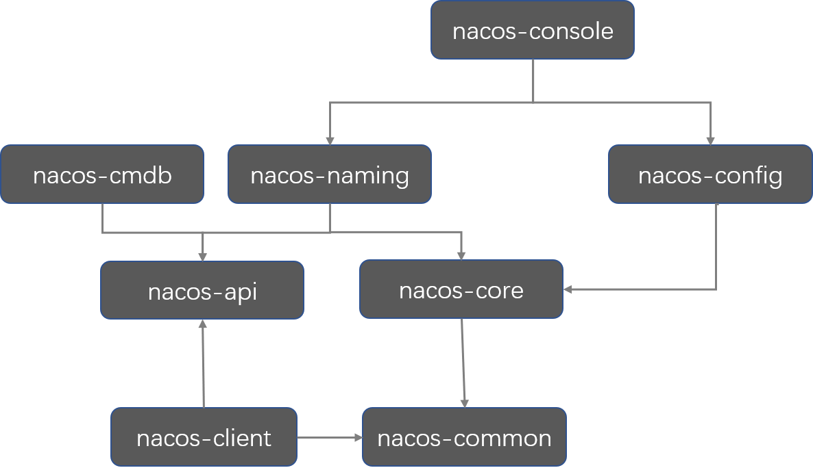
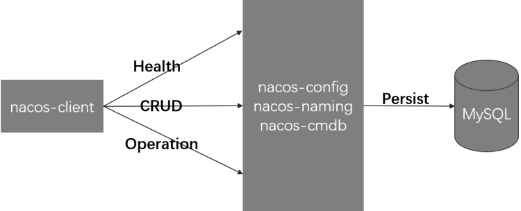
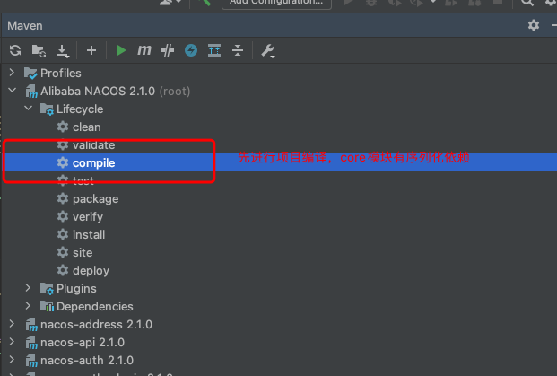
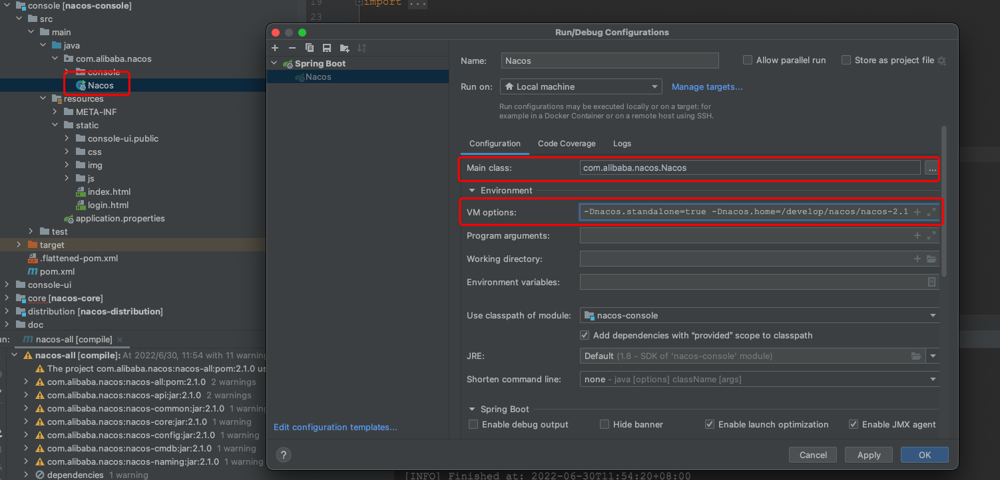

# Nacos源码开篇

## Nacos服务注册与发现源码剖析

### Nacos核心功能点

**服务注册**：Nacos Client会通过发送REST请求的方式向Nacos Server注册自己的服务，提供自身的元数据，比如ip地址、端口等信息。Nacos Server接收到注册请求后，就会把这些元数据信息存储在一个双层的内存Map中。 

**服务心跳**：在服务注册后，Nacos Client会维护一个定时心跳来持续通知Nacos Server，说明服务一直处于可用状态，防止被剔除。默认5s发送一次心跳。

**服务健康检查**：Nacos Server会开启一个定时任务用来检查注册服务实例的健康情况，对于超过15s没有收到客户端心跳的实例会将它的healthy属性置为false(客户端服务发现时不会发现)，如果某个实例超过30秒没有收到心跳，直接剔除该实例(被剔除的实例如果恢复发送心跳则会重新注册)

**服务发现**：服务消费者（Nacos Client）在调用服务提供者的服务时，会发送一个REST请求给Nacos Server，获取上面注册的服务清单，并且缓存在Nacos Client本地，同时会在Nacos Client本地开启一个定时任务定时拉取服务端最新的注册表信息更新到本地缓存

**服务同步**：Nacos Server集群之间会互相同步服务实例，用来保证服务信息的一致性。 


### Nacos服务端原理




### Nacos客户端原理




​	其实从以上的两张图中我们就能够找到突破口了，其实核心内容就集中在nacos-console、nacos-naming、nacos-config，这几个模块中。那么知道了这些，现在我们就来进行Nacos的源码下载，然后我们具体分析。

## Nacos源码下载

我们本次需要通过IDEA2021.2开发工具来运行Nacos，所以提前下载好Nacos2.1的源代码：

下载地址为：https://github.com/alibaba/nacos/releases，然后解压到磁盘的某个目录下，并进行IDEA的导入。

**1、编译项目工程**




**2、源码单机运行：**

首先要找到nacos-console这个模块，直接运行console模块里的 com.alibaba.nacos.Nacos.java，运行的时候，在IDEA的JVM的启动参数中增加为独立运行模式，和Nacos的主目录，如图所示：

```java
-Dnacos.standalone=true -Dnacos.home=/develop/nacos/nacos-2.1.0
```



配置好之后就可以运行测试，和启动普通的SpringBoot聚合项目一样，启动之后我们也可以直接访问：http://localhost:8848/nacos，这个时候就能看到我们以前看到的对应客户端页面了，到此为止我们的Nacos源码启动就完成了。


